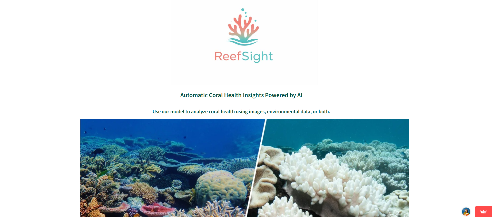

# 🪸 ReefSight Frontend



*Interactive Streamlit interface for exploring coral bleaching predictions using image and environmental inputs.*

The **ReefSight Frontend** is an interactive **Streamlit-based web application** that allows users to explore coral bleaching risk predictions through an intuitive visual interface. It serves as the user-facing layer of the ReefSight system, communicating with the ReefSight backend API to perform image-based and tabular coral health inference.

This repository is intentionally **decoupled** from the backend machine-learning logic, which lives in a separate repository.

---

## 🌐 Live Demo

The ReefSight frontend is deployed as a public Streamlit application and can be accessed here:

👉 [https://reefsight.streamlit.app/](https://reefsight.streamlit.app/)

The live application allows users to:

* Upload coral reef images for bleaching classification
* Explore predictions using geospatial and environmental context
* Interact with the system without any local setup

---

## 🌊 Project Purpose

Coral bleaching prediction is only useful if results are **accessible and interpretable**. The ReefSight Frontend focuses on:

* Making AI-based coral health predictions usable by non-technical users
* Providing intuitive geospatial and visual interactions
* Allowing flexible experimentation with image and environmental inputs

The frontend does **not train models**; it orchestrates user input, API communication, and visualization.

---

## 🏗️ Architecture Overview

```
User
 ↓
Streamlit Frontend (this repo)
 ↓ HTTP requests
ReefSight Backend API
```

* **Frontend framework**: Streamlit
* **Backend communication**: REST API calls
* **Visualization**: Folium maps, images, tables

🔗 Backend repository:
[https://github.com/Lucia-Cordero/ReefSight-Project](https://github.com/Lucia-Cordero/ReefSight-Project)

---

## 📁 Repository Structure

```
ReefSight_front/
├── app-copy.py           # Main Streamlit application
├── pages/                # Multi-page Streamlit views
├── media/                # UI assets (images, icons)
├── tests/                # Frontend tests
├── .streamlit/           # Streamlit configuration
├── requirements.txt
├── Makefile
└── README.md
```

---

## 🖥️ Application Features

### 📸 Image-Based Prediction

* Upload coral reef images (`.jpg`, `.png`, `.jpeg`)
* Preview images before submission
* Send images to the backend image prediction endpoint
* Display bleaching classification results

### 📊 Tabular & Environmental Prediction

* Select reef location via an interactive **Folium map**
* Choose observation date
* Automatically query backend for environmental feature enrichment
* Optionally override environmental variables manually

### 🌍 Multi-Modal Exploration

* Combine image input with environmental context
* Compare prediction modes within a single workflow
* Designed for exploratory analysis rather than automated decision-making

---

## 🔌 Backend Dependency

This frontend **requires** a running instance of the ReefSight backend API.

By default, the frontend expects the backend to be available locally at:

```
http://localhost:8000
```

Ensure the backend is running **before** launching the frontend.

---

## 🚀 Running the Frontend Locally

### 1. Install Dependencies

```bash
pip install -r requirements.txt
```

### 2. Run the Streamlit App

```bash
streamlit run app-copy.py
```

The application will open automatically in your browser.


---

## 📌 Notes & Limitations

* The frontend assumes a **stable backend API contract**
* No offline inference is supported
* Predictions are intended for **research, educational, and exploratory use only**

---

## 📄 License

MIT License

---

🪸 *ReefSight Frontend bridges complex coral bleaching models with human‑centered design, enabling accessible exploration of reef health through AI.*
